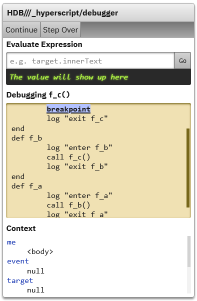
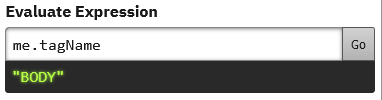
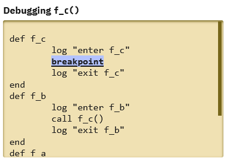

# HDB: the _hyperscript debugger

HDB is a tool for inspecting _hyperscript code. You can use it to run code one command at a time and inspect the environment at each step.

To start hdb, put the `breakpoint` command in your code:

```hyperscript
def f_c
	log "enter f_c"
	breakpoint
	log "exit f_c"
end

def f_b
...
```

This will cause the code execution to stop and the HDB panel to appear.

## HDB UI



The UI surfaces three features:

* Evaluation panel
* Code view
* Context view

### Evaluation panel

You can enter any _hyperscript expression, click "Go" (or press Enter) and its value will be displayed below.



### Code view

This section shows the code that's currently executing. The command that's currrently being executed is highlighted (when you first open the panel, this will be the `breakpoint` command). By clicking the <kbd>Step Over</kbd> button in the top toolbar, you can execute this command and move on to the next. When you're finished with debugging, or want to move on to the next breakpoint, press <kbd>Continue</kbd> to continue executing the remaining code normally.



### Context view

This section shows the local variables available to the currently executing code. You can click on any variable name to log that variable to the console.

## HDB On The Console

When you start HDB, it will assign an object to the global scope with methods for inspecting the _hyperscript environment.

### `hdb.ctx`

The current hyperscript context, an object containing the local variables.

### `hdb.cmd`

The currently executing command.

### `hdb.logCommand()`

Logs the currently executing command.

### `hdb.stepOver()`

Executes the current command, then moves to the next.

### `hdb.continueExec()`

Stops debugging and the program continues executing normally.
